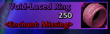

> 	-- btn:SetNormalTexture(nil)
is not allowed to be nil, and crashes the addon

* The strata of the addon is wrong, it's appearing behind static elements on screen

* Addon doesn't have the markers needed for any console port navigation

* use items ('Use: ' in description) should get their own category, so i can instantly see 'unboxable items'

* different groups should have a slightly different background color to the actual background, so the group is easier to distinquish from the other groups, or a frame

* icons are too small, and thus covered by the text on top and making it hard to distingquish what the item is

POTENTIAL IMPROVEMENTS

* item's could have a label, the same way as character screen has for equipment, and thus each of the subcategories would become a list example

	

* This could extend to other item types and be used to deduplicate un-nessessary data, for example instead of having 2 different types of rocks with full identical icon and the difference being the quality tag in the corner you could have something like (concept don't pull colors and shit from this, it's literally i made it in paint, so it's shit...)

	